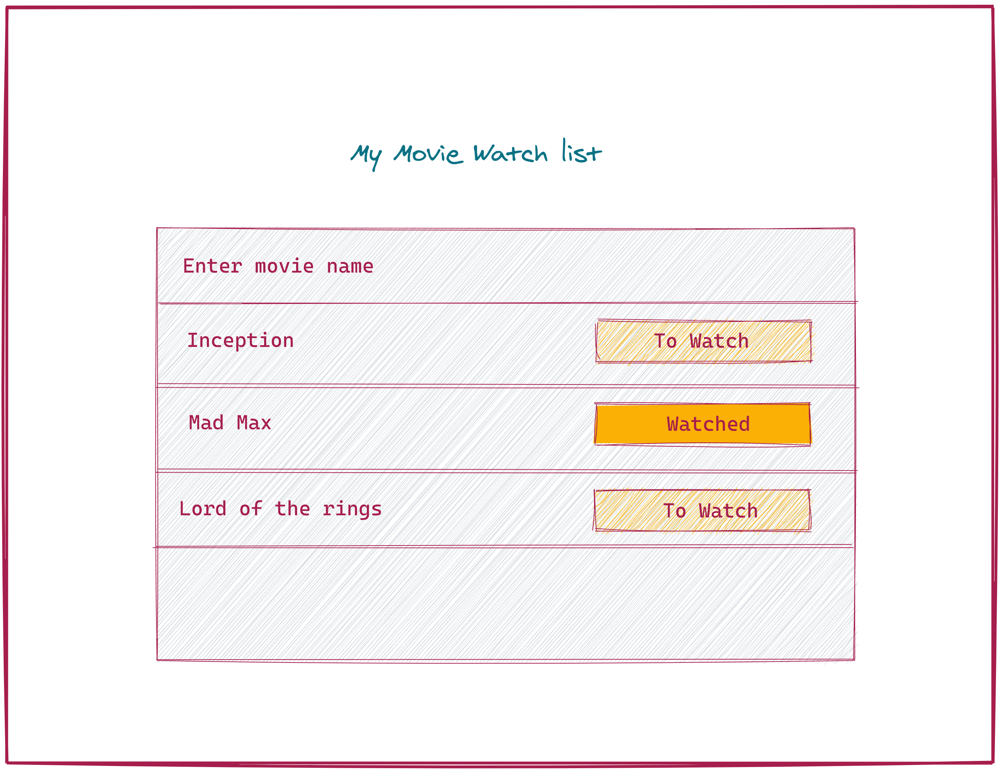

#### Movie App

So before going into React let's try to understand the problem it solves. To do that we will be making a small application using vanilla JavaScript named "Movie Watch List App". To create this application use HTML, CSS and JavaScript.

#### Requirements

- User can enter a movie name
- If you press enter after the movie will be added to the list below
- Each movie will have status (Either watched or To Watch)
- Default status will be `To Watch`
- Clicking on button should change the state form `To Watch` to `Watched` or vice versa.
- Use vanilla (plain) JavaScript to make this application.
- Add `localStorage` support

#### How to make app

- In this folder you will find a `html`, `css` and `js` file.
- Add code in the respective files.
