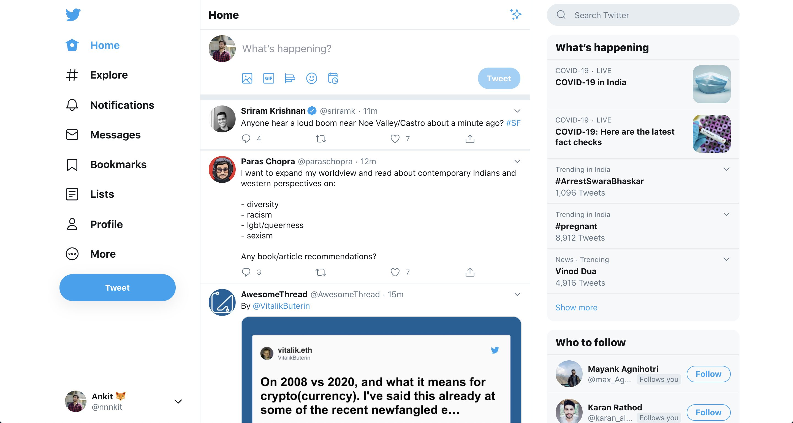

#### Layout to Components

- You have been give a layout (Twitter Layout) below
- Use any drawing tool / notebook to break the layout into small small components.
- Name the components on top of images or create a similar layout on notebook with component name.
- If you are creating the structure on notebook take screenshot and upload
- If you are using any drawing tools take screenshot and upload.

- 
