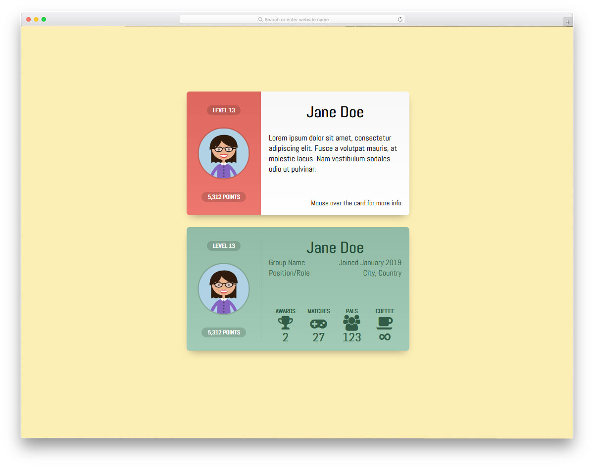

#### Create User Card

- You will find the data in the file named `users.json`
- The data consists of the 12 fields
- You should create one card component
- Using the component display all user info as card

- Take care of the following things
- Based on user gender either display (male/female) 🙋‍♂️ or 🤷‍♀️ emoji
- Based on `favoriteFruit` use respective fruit emoji/image
- If the `isActive` property is true the background of card should be `#A7F3D0` or `#FECACA`

You can take inspiration from this UI

