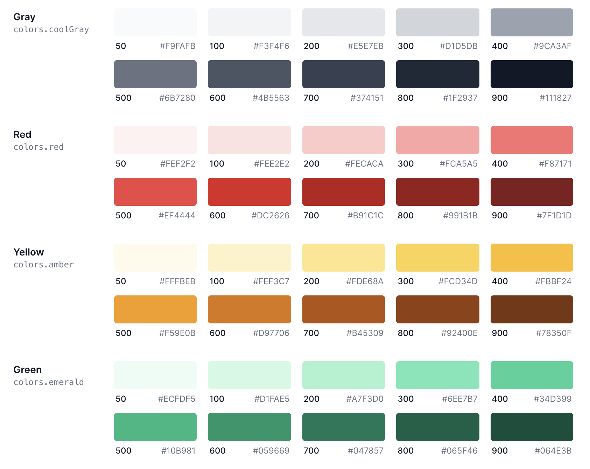

#### Create Colors Structure

- Create a structure like give in preview
- Use the data from the file `colors.json`
- Replace the name of the color
- First element of the color in array starts with `50` and last is `900`.

### Preview

